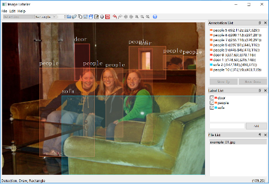
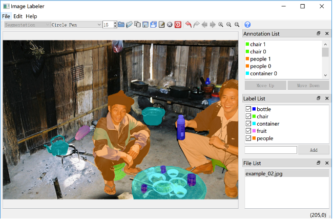
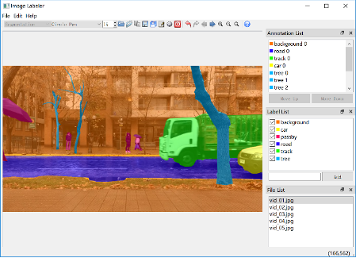
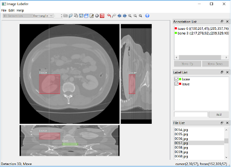
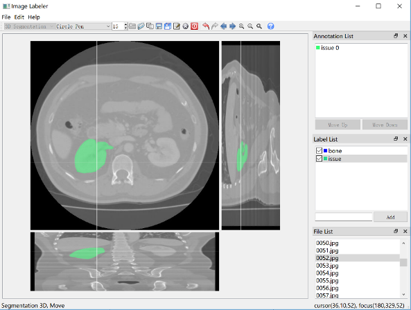

# ImageLabeler

Jialong Wu

## Introduction

This project uses Qt to develop an image data annotation tool with a graphical interface for data preparation in the field of artificial intelligence, specifically for users to annotate **2D** and **3D** images in two ways: 

1. Detection annotation: mark the smallest possible rectangular (cube) box covering an object in the image and add a label to the box. 
2. Segmentation annotation: indicates the pixels (voxels) covered by the object in the image, and also adds a label to the shape.

For details, please refer to our report (*in Chinese*).

## Environment

Qt 5.12.4, Qt Creator 4.9.2

## Installation

Download link for Windows Application: [Google Drive](https://drive.google.com/file/d/1BQ8jBtVMa8WzyCPnTMI7leY5lvT-D3gr/view?usp=sharing).

## Usage 

We refer users to Section 3 in our [project report](https://github.com/Manchery/ImageLabeler/blob/master/doc/%E5%9F%BA%E4%BA%8EQt%E5%AE%9E%E7%8E%B0%E7%9A%84%E5%9B%BE%E7%89%87%E6%95%B0%E6%8D%AE%E6%A0%87%E6%B3%A8%E5%B7%A5%E5%85%B7_%E6%96%87%E6%A1%A3.pdf) (*in Chinese*) for detailed instructions for use.

## Snapshots

  

  

  

  

  

## Acknowledgement 

We are very grateful for the reference, [labelme](https://github.com/wkentaro/labelme).

This is the course project for Practical Training For Programming in School of Software, Tsinghua University, instructed by [Prof. Xu](http://xufeng.site/). We would like to thank Prof. Xu and TAs for their devotion to the course.

## References

1. [labelme](https://github.com/wkentaro/labelme)
2. [Qt document](https://doc.qt.io/qt-5/index.html)
3. [Random colors Qt](https://gist.github.com/ialhashim/b39a68cf48a0d2e66621)
4. [QDarkStyleSheet](https://github.com/ColinDuquesnoy/QDarkStyleSheet)
